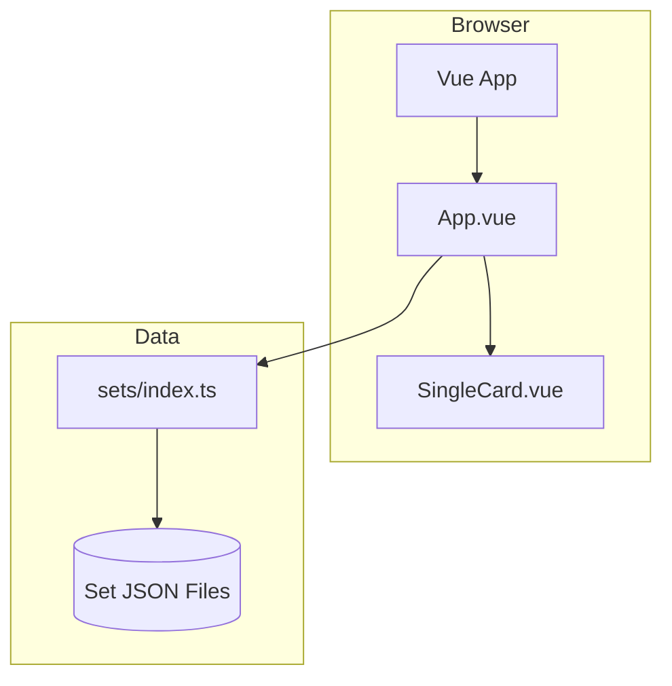
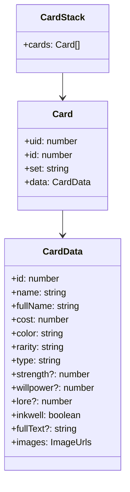
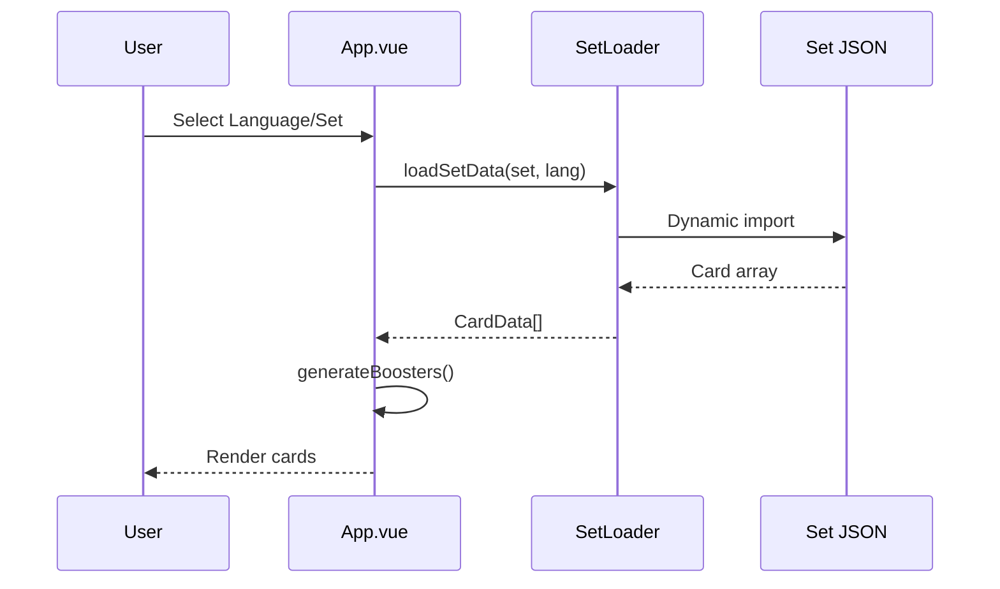

# Lorcana Sealed Simulator - Architecture

## Overview

A Vue 3 web application simulating the Lorcana Sealed format (opening boosters and building a deck).



## Tech Stack

| Component  | Technology |
|------------|------------|
| Framework  | Vue 3 (Composition API) |
| Language   | TypeScript |
| Build Tool | Vite |
| Data Source | LorcanaJSON.org API |
| Deployment | GitHub Pages via Actions |

## Project Structure

```
src/
├── main.ts              # Entry point
├── App.vue              # Main component + business logic
├── style.css            # Global styles + theme variables
├── components/
│   └── SingleCard.vue   # Card display component
└── data/
    ├── allCards.json    # Legacy card database
    └── sets/
        ├── index.ts     # Set loader + metadata
        ├── en/          # English set data
        ├── de/          # German set data
        ├── fr/          # French set data
        └── it/          # Italian set data
```

## Class Model



## Data Flow



## State Management

All state is managed via Vue 3 Composition API (`ref`, `reactive`, `computed`):

| State | Type | Description |
|-------|------|-------------|
| `stacks` | `CardStack[]` | Booster card stacks |
| `deckCards` | `Card[]` | User's deck |
| `currentView` | `'boosters' \| 'deck'` | Active view |
| `selectedLanguage` | `string` | Current language |
| `selectedSet` | `string` | Current set |
| `autoSort` | `boolean` | Auto-sort toggle |
| `settings` | `reactive` | Booster configuration |

## Deployment

```mermaid
flowchart LR
    Push[Push to master] --> GH[GitHub Actions]
    GH --> Build[npm run build]
    Build --> Dist[/dist]
    Dist --> Pages[GitHub Pages]
```

Automatic deployment on push to `master` via GitHub Actions workflow.
