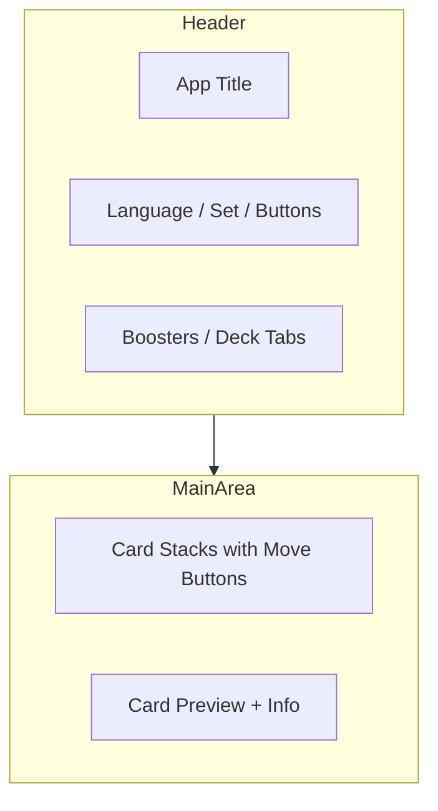

# Lorcana Sealed Simulator - Design

## UI Layout



## Component Hierarchy

```
App.vue
├── Header
│   ├── Language Select
│   ├── Set Select
│   ├── New Boosters Button
│   ├── View Tabs (Boosters / Deck)
│   ├── Auto Sort Toggle
│   └── Settings Button
├── Settings Panel (collapsible)
├── Main Layout
│   ├── Card Stacks
│   │   └── SingleCard (multiple, with move buttons)
│   └── Preview Zone
│       ├── SingleCard (fullView)
│       └── Card Info
└── Dialogs
    ├── Confirm Dialog
    └── Export Dialog
```

## SingleCard Component

Two display modes:

| Mode | Usage | Description |
|------|-------|-------------|
| `condensedCard` | Stack view | Compact row showing cost + card name |
| `fullView` | Preview | Full card image (250px) |
| `location` | Landscape cards | Rotated display for Location type |

### Props

```typescript
interface Props {
  set: string | number  // Set code
  id: number            // Card ID
  data: CardData        // Card data object
  locale?: string       // Language code
  fullView?: boolean    // Enable full view mode
}
```

## Theming

CSS Variables for light/dark mode support:

```css
:root {
  --bg-primary: #1a1a1a;      /* Main background */
  --bg-secondary: #2a2a2a;    /* Cards, inputs */
  --text-primary: #f0f0f0;    /* Main text */
  --text-muted: #888;         /* Secondary text */
  --accent-primary: #4a6fa5;  /* Buttons, highlights */
  --border-primary: #444;     /* Borders */
}

@media (prefers-color-scheme: light) {
  :root {
    --bg-primary: #ffffff;
    --text-primary: #1a1a1a;
    /* ... adapted colors */
  }
}
```

## Card Info Display

The preview zone shows detailed card information:

| Field | Description |
|-------|-------------|
| Name | Full card name (Name - Version) |
| Type | Character, Item, Action, Song, Location |
| Subtypes | Classifications (Storyborn, Hero, etc.) |
| Stats | Cost ⬡, Strength ⚔, Willpower 🛡, Lore ◇ |
| Rarity | Color-coded badge |
| Inkable | Blue badge if card can be inked |
| Text | Card abilities and effects |

## Responsive Design

- **Desktop**: Side-by-side layout (cards + preview)
- **Mobile** (< 900px): Stacked layout, preview on top
- **Min-width**: 320px

## Card View CSS Technique

The condensed card view extracts cost and name from the full card image using `background-position`:

```css
div.cardCost {
  width: 26px;
  background-size: 620%;
  background-position: -3px -3px;  /* Top-left corner */
}

div.cardMain {
  width: 195px;
  background-size: 105%;
  background-position: -4px 705px;  /* Name bar area */
}
```
