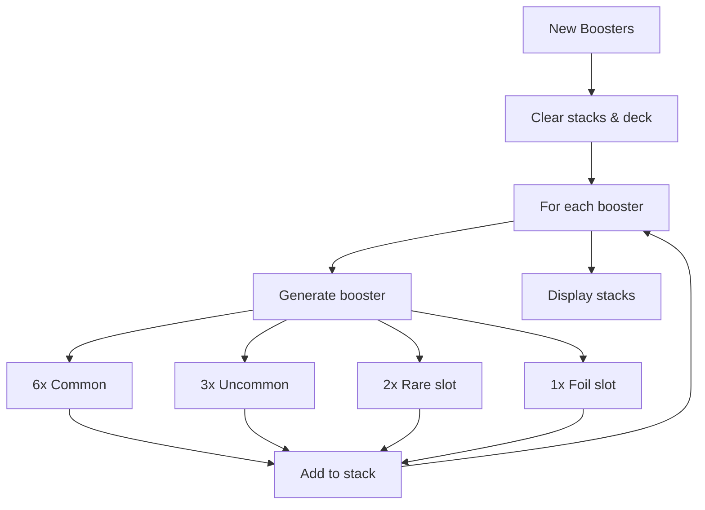

# Feature: Booster Generation

## Overview

Simulates opening Lorcana booster packs with configurable pull rates matching official distribution.

## Booster Structure

Each booster contains 12 cards:

| Slot | Count | Description |
|------|-------|-------------|
| Common | 6 | Base common cards |
| Uncommon | 3 | Uncommon cards |
| Rare Slot | 2 | Rare or higher rarity |
| Foil Slot | 1 | Any rarity (foil) |

## Pull Rate Configuration

### Rare Slot Rates (Default)

| Rarity | Chance |
|--------|--------|
| Rare | 64% |
| Super Rare | 25% |
| Legendary | 10% |
| Enchanted | 1% |

### Foil Slot Rates (Default)

| Rarity | Chance |
|--------|--------|
| Common | 40% |
| Uncommon | 30% |
| Rare | 15% |
| Super Rare | 10% |
| Legendary | 4% |
| Enchanted | 1% |

## Settings UI

Users can customize:

- Number of boosters (1-36)
- Cards per slot (Commons, Uncommons, Rare slots, Foil slots)
- Pull rate percentages for each rarity

Settings are accessible via the ⚙️ Settings button.

## Flow Diagram

## Confirmation Dialog

When clicking "New Boosters" with cards in deck:

- Shows warning with card count
- Requires confirmation before clearing
- Cancel returns to current state
