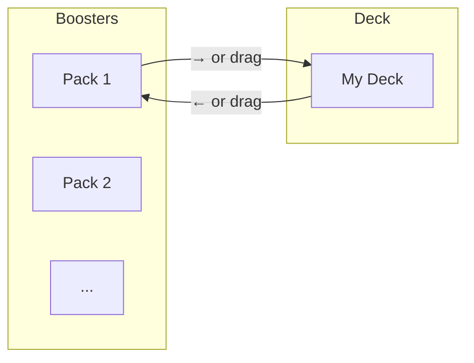

# Feature: Deck Building

## Overview

Build your deck by moving cards between boosters and deck views.

## Views

### Boosters View (📦)
- Displays opened booster packs
- Each pack shown as a card stack
- Cards can be moved to deck

### Deck View (🃏)
- Shows collected deck cards
- Single stack display
- Card count shown in tab
- Export functionality available

## Moving Cards

### Method 1: Drag and Drop

1. Grab any card (cursor changes to ✋)
2. Drag to target tab (Boosters or Deck)
3. Tab highlights on hover
4. Drop to transfer card

### Method 2: Click Button

Each card has a move button:
- **→** (in Boosters): Move card to Deck
- **←** (in Deck): Move card back to Boosters

## Flow

## Auto-Sort

When enabled (✓ Auto Sort):
- Automatically sorts after each card move
- Applies to both Boosters and Deck
- Boosters: Groups by cost (1, 2, 3, 4, 5, 6+)
- Deck: Sorts by cost → color → ID

## Empty Deck State

When deck is empty:
- Shows placeholder message
- Hints to add cards from boosters
- Export button hidden
