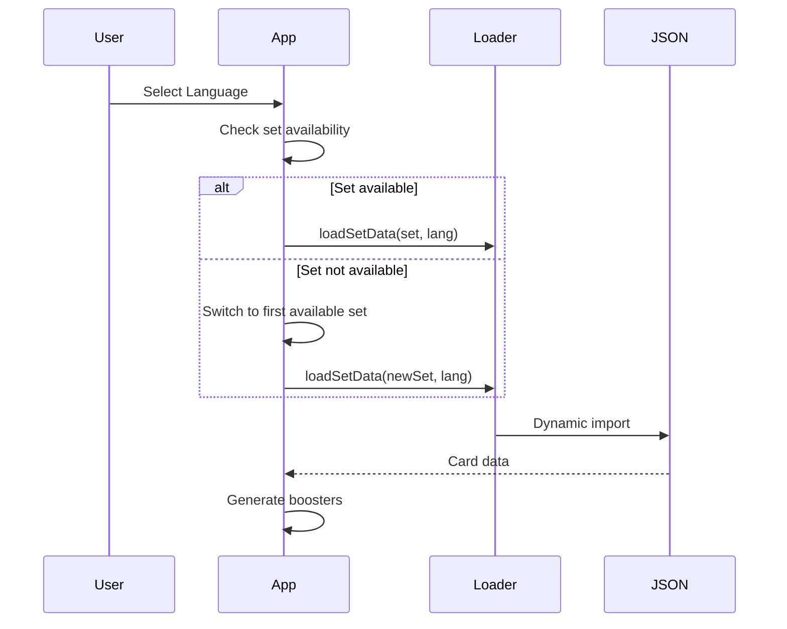

# Feature: Multi-Language Support

## Overview

Switch between multiple languages for card display and data.

## Supported Languages

| Code | Language | Sets Available |
|------|----------|----------------|
| en | English | All sets |
| de | German | Sets 1-10, Q1-Q2 |
| fr | French | Sets 1-10, Q1-Q2 |
| it | Italian | Sets 1-10, Q1 |

## Language Selector

Located in the header controls:
- Dropdown menu with all languages
- Changing language reloads set data
- Set selector updates to show available sets

## Automatic Set Switching

If current set is not available in selected language:
- Automatically switches to first available set
- No manual intervention needed

## Localized Data

### Card Names
Card names displayed in selected language.

### Rarity Names
Rarity terms are localized:

| English | German | French | Italian |
|---------|--------|--------|---------|
| Common | Gewöhnlich | Commune | Comune |
| Uncommon | Ungewöhnlich | Inhabituelle | Non comune |
| Rare | Selten | Rare | Rara |
| Super Rare | Episch | Très rare | Super rara |
| Legendary | Legendär | Légendaire | Leggendaria |
| Enchanted | Verzaubert | Enchantée | Incantata |

### Card Types
Card types shown in selected language:
- Location → Ort (DE), Lieu (FR), Luogo (IT)

## Export Behavior

Deck export always uses English names for tournament compatibility, regardless of selected display language.

## Technical Implementation

